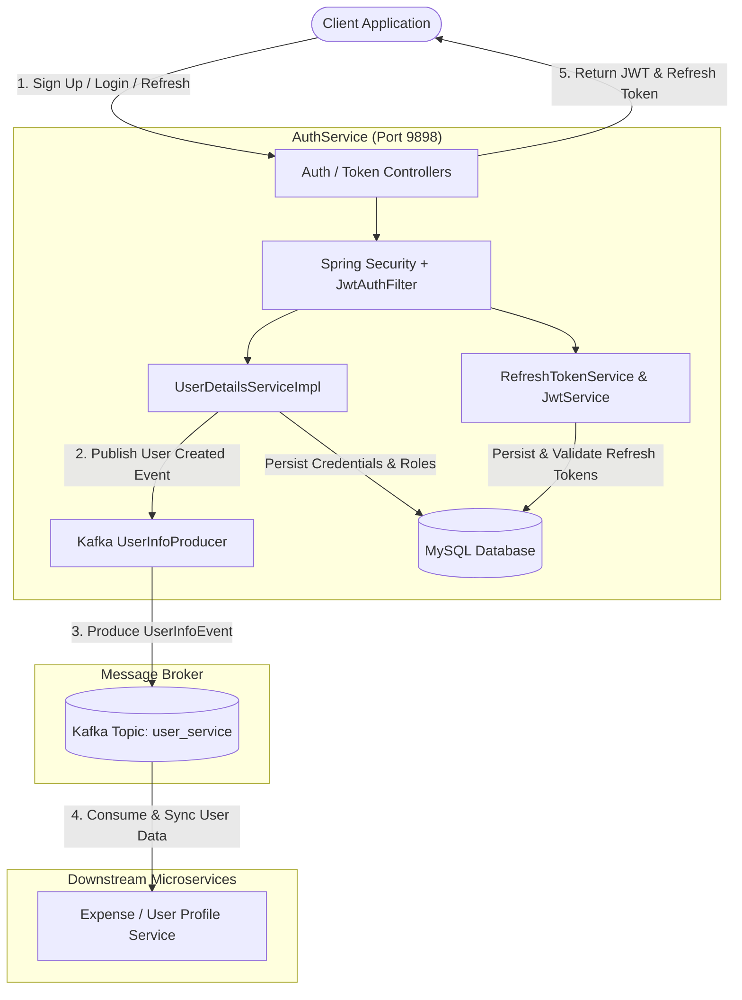
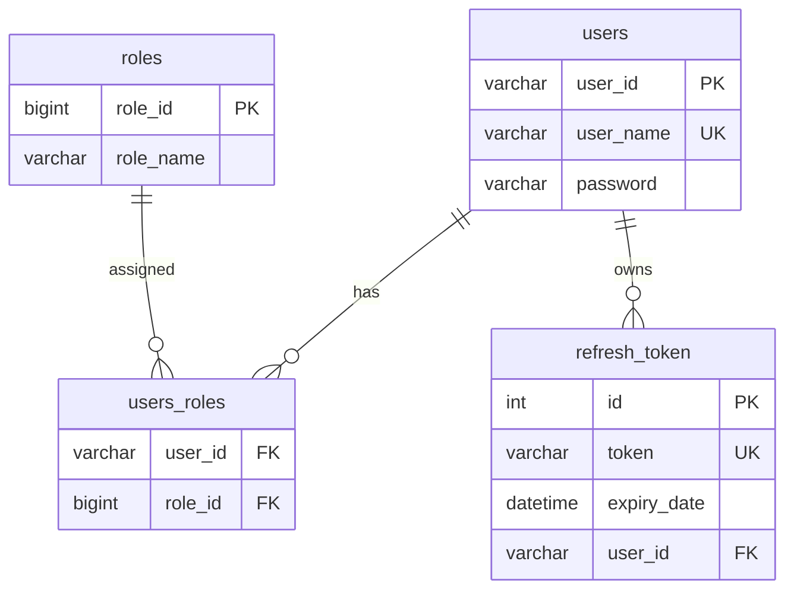

# Expense Tracker - Authentication & Authorization Service (AuthService)

[](https://www.oracle.com/java/technologies/downloads/#java21)
[](https://spring.io/projects/spring-boot)
[](https://spring.io/projects/spring-security)
[](https://kafka.apache.org/)
[](https://www.mysql.com/)
[](https://gradle.org/)

The **Authentication & Authorization Service (AuthService)** is the identity and access management backbone of the **Expense Tracker** microservices ecosystem. It provides secure user onboarding, authentication via JSON Web Tokens (JWT), refresh token lifecycle management, and event-driven user synchronization with downstream microservices using **Apache Kafka**.

---

## Table of Contents

- [Architecture & Workflow](#architecture--workflow)
- [Key Features](#key-features)
- [Tech Stack](#tech-stack)
- [Project Structure](#project-structure)
- [Prerequisites](#prerequisites)
- [Configuration](#configuration)
- [Building & Running](#building--running)
- [API Documentation](#api-documentation)
  - [1. User Sign Up](#1-user-sign-up)
  - [2. User Login](#2-user-login)
  - [3. Refresh Access Token](#3-refresh-access-token)
  - [4. Authenticated Request Example](#4-authenticated-request-example)
- [Kafka Event Publishing](#kafka-event-publishing)
- [Database Schema](#database-schema)
- [Contributing](#contributing)

---

## Architecture & Workflow



---

## Key Features

- **Stateless Authentication**: Issues HMAC-SHA256 signed JSON Web Tokens (JWT) with a 1-hour expiration period.
- **Refresh Token Rotation**: Manages revocable, database-persisted UUID refresh tokens with expiration checks.
- **Password Hashing**: Uses `BCryptPasswordEncoder` for safe password hashing and salted verification.
- **Event-Driven User Onboarding**: On user registration, securely publishes a `UserInfoEvent` to Apache Kafka topic `user_service` to automatically replicate user profile details across other expense tracker services.
- **Role-Based Security**: Extensible role assignment (`USER`, `ADMIN`, etc.) using Spring Security filters.
- **Stateless Session Policy**: Configured with `SessionCreationPolicy.STATELESS` and custom `JwtAuthFilter` preceding the Spring Security authentication filter chain.

---

## Tech Stack

| Component | Technology | Version / Description |
| :--- | :--- | :--- |
| **Language** | Java | 21 |
| **Framework** | Spring Boot | 3.3.4 |
| **Security** | Spring Security & OAuth2 | 6.x |
| **JWT** | JJWT (`jjwt-api`, `jjwt-impl`, `jjwt-jackson`) | 0.12.5 |
| **Message Broker**| Apache Kafka (`spring-kafka`) | Event streaming producer |
| **Database** | MySQL | Spring Data JPA / Hibernate |
| **Serialization**| Jackson | Snake-case mapping, custom Kafka serializers |
| **Boilerplate** | Project Lombok | Clean model, entity, and builder definitions |
| **Build Tool** | Gradle | Multi-project setup with wrapper |

---

## Project Structure

```
expense-tracker/
├── app/
│   ├── build.gradle
│   └── src/
│       ├── main/
│       │   ├── java/org/example/
│       │   │   ├── App.java                               # Spring Boot Application entrypoint
│       │   │   ├── auth/
│       │   │   │   ├── JwtAuthFilter.java                 # Intercepts & validates Bearer tokens
│       │   │   │   ├── SecurityConfig.java                # Spring Security filter chain configuration
│       │   │   │   └── UserConfig.java                    # PasswordEncoder bean definition
│       │   │   ├── controller/
│       │   │   │   ├── AuthController.java                # Sign-up endpoint
│       │   │   │   └── TokenController.java               # Login & token refresh endpoints
│       │   │   ├── entities/
│       │   │   │   ├── RefreshTokens.java                 # Refresh token JPA entity
│       │   │   │   ├── UserInfo.java                      # User entity (credentials & roles)
│       │   │   │   └── UserRole.java                      # Role entity
│       │   │   ├── eventProducer/
│       │   │   │   ├── UserInfoEvent.java                 # Kafka event DTO payload
│       │   │   │   └── UserInfoProducer.java              # Kafka producer service
│       │   │   ├── model/
│       │   │   │   └── UserInfoDto.java                   # User registration request data model
│       │   │   ├── request/
│       │   │   │   ├── AuthRequestDTO.java                # Login request DTO
│       │   │   │   └── RefreshTokenRequest.java           # Refresh token request DTO
│       │   │   ├── response/
│       │   │   │   └── JwtResponseDto.java                # Token response (accessToken, token)
│       │   │   ├── respository/
│       │   │   │   ├── RefreshTokenRepository.java        # Spring Data JPA for RefreshTokens
│       │   │   │   └── UserRepository.java                # Spring Data JPA for UserInfo
│       │   │   ├── Serializer/
│       │   │   │   └── UserInfoSerializer.java            # Kafka Serializer for UserInfoEvent
│       │   │   └── service/
│       │   │       ├── CustomUserDetails.java             # Spring Security UserDetails adapter
│       │   │       ├── JwtService.java                    # Token generation, signing & claim extraction
│       │   │       ├── RefreshTokenService.java           # Refresh token creation & TTL validation
│       │   │       └── UserDetailsServiceImpl.java        # User persistence & Kafka event triggering
│       │   └── resources/
│       │       └── application.properties                 # App configuration & credentials
├── gradle/
├── gradlew
├── gradlew.bat
├── settings.gradle
└── README.md
```

---

## Prerequisites

Ensure you have the following installed and running:

- **Java JDK 21+** (`java -version`)
- **MySQL 8.0+** running with a database named `authservice` (or as configured)
- **Apache Kafka** broker running (e.g. at `localhost:9092`)

---

## Configuration

Application settings are located in [application.properties](file:///g:/hj/java%20projects/AuthService/app/src/main/resources/application.properties). You can customize database and Kafka settings via environment variables or direct properties:

```properties
# Server Port
server.port=9898

# Database Configuration
spring.datasource.driver-class-name=com.mysql.cj.jdbc.Driver
spring.datasource.url=jdbc:mysql://localhost:3306/${MYSQL_DB:authservice}?useSSL=false&allowPublicKeyRetrieval=true
spring.datasource.username=${DB_USER:root}
spring.datasource.password=${DB_PASSWORD:password}
spring.jpa.hibernate.ddl-auto=update
spring.jpa.show-sql=true

# Apache Kafka Configuration
spring.kafka.bootstrap-servers=${KAFKA_SERVER:localhost:9092}
spring.kafka.producer.bootstrap-servers=${KAFKA_SERVER:localhost:9092}
spring.kafka.topic.name=user_service
spring.kafka.producer.key.serializer=org.apache.kafka.common.serialization.StringSerializer
spring.kafka.producer.value.serializer=org.example.serializer.UserInfoSerializer
```

---

## Building & Running

### Using the Gradle Wrapper

1. **Clone the repository:**
   ```bash
   git clone https://github.com/Hard12-j/expense-tracker.git
   cd expense-tracker
   ```

2. **Build the project:**
   ```bash
   # On Linux/macOS:
   ./gradlew build

   # On Windows:
   gradlew.bat build
   ```

3. **Run the service:**
   ```bash
   # On Linux/macOS:
   ./gradlew :app:bootRun

   # On Windows:
   gradlew.bat :app:bootRun
   ```

The application will start on port `9898`.

---

## API Documentation

### Base URL
`http://localhost:9898`

---

### 1. User Sign Up

Registers a new user, hashes the password, persists user records, dispatches an event to Kafka, and immediately returns access & refresh tokens.

- **Method**: `POST`
- **Endpoint**: `/auth/v1/signup`
- **Headers**: `Content-Type: application/json`

#### Request Body
```json
{
  "user_name": "johndoe",
  "password": "SecurePassword123!",
  "first_name": "John",
  "last_name": "Doe",
  "email": "john.doe@example.com",
  "phone_number": 9876543210
}
```

#### Response (`200 OK`)
```json
{
  "accessToken": "eyJhbGciOiJIUzI1NiJ9.eyJzdWIiOiJqb2huZG9lIiwiaWF0IjoxNzA...",
  "token": "4a7f920c-512c-47bc-bb1d-e59178ad38e9"
}
```

> **Note**: If the username already exists, the endpoint returns `400 Bad Request` with message `"Already Exist"`.

---

### 2. User Login

Authenticates user credentials and issues a fresh JWT access token and a refresh token.

- **Method**: `POST`
- **Endpoint**: `/auth/v1/login`
- **Headers**: `Content-Type: application/json`

#### Request Body
```json
{
  "userName": "johndoe",
  "password": "SecurePassword123!"
}
```

#### Response (`200 OK`)
```json
{
  "accessToken": "eyJhbGciOiJIUzI1NiJ9.eyJzdWIiOiJqb2huZG9lIiwiaWF0IjoxNzA...",
  "token": "4a7f920c-512c-47bc-bb1d-e59178ad38e9"
}
```

---

### 3. Refresh Access Token

Exchanges a valid, non-expired refresh token for a newly signed JWT access token.

- **Method**: `POST`
- **Endpoint**: `/auth/v1/refreshToken`
- **Headers**: `Content-Type: application/json`

#### Request Body
```json
{
  "Token": "4a7f920c-512c-47bc-bb1d-e59178ad38e9"
}
```

#### Response (`200 OK`)
```json
{
  "accessToken": "eyJhbGciOiJIUzI1NiJ9.eyJzdWIiOiJqb2huZG9lIiwiaWF0IjoxNzA...",
  "token": "4a7f920c-512c-47bc-bb1d-e59178ad38e9"
}
```

---

### 4. Authenticated Request Example

For any protected routes in the ecosystem, pass the JWT access token in the `Authorization` header:

```bash
curl -X GET http://localhost:9898/api/protected-resource \
  -H "Authorization: Bearer <your_jwt_access_token>"
```

---

## Kafka Event Publishing

When a user successfully signs up, `UserInfoProducer` asynchronously publishes an event to the `user_service` topic so other microservices in the Expense Tracker platform can initialize user accounts and profiles.

#### Topic: `user_service`
#### Event Payload Schema (`snake_case`):
```json
{
  "user_id": "c1f6d90a-1175-4089-980b-df7ceceb9d88",
  "first_name": "John",
  "last_name": "Doe",
  "email": "john.doe@example.com",
  "phone_number": 9876543210
}
```

---

## Database Schema



---

## Contributing

1. Fork the repository
2. Create your feature branch (`git checkout -b feature/amazing-feature`)
3. Commit your changes (`git commit -m 'feat: Add amazing feature'`)
4. Push to the branch (`git push origin feature/amazing-feature`)
5. Open a Pull Request
